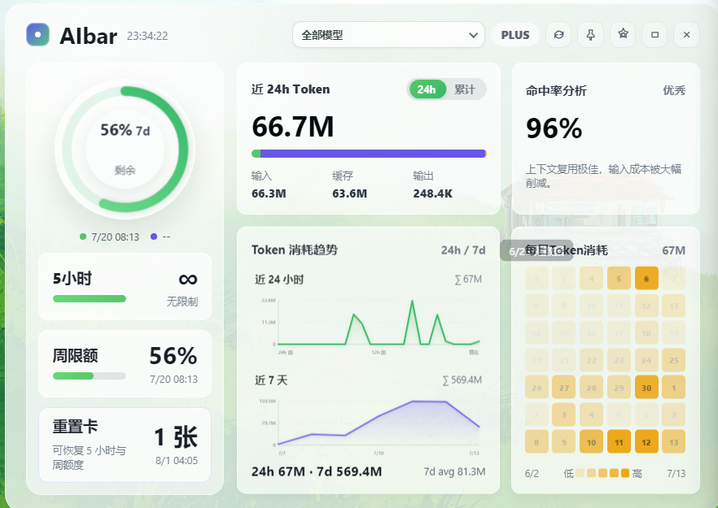
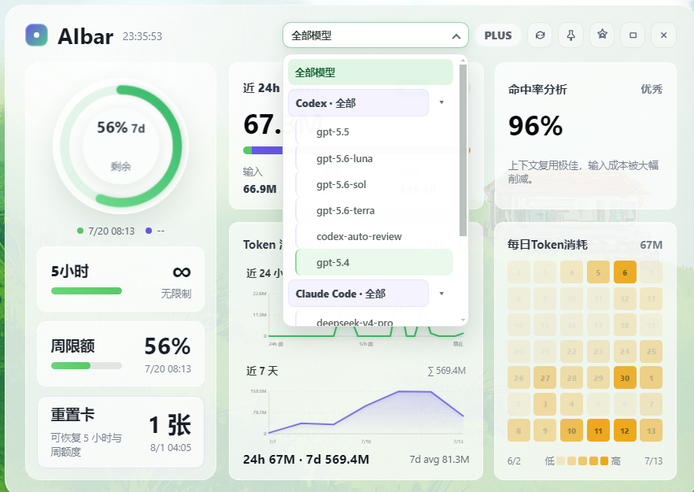
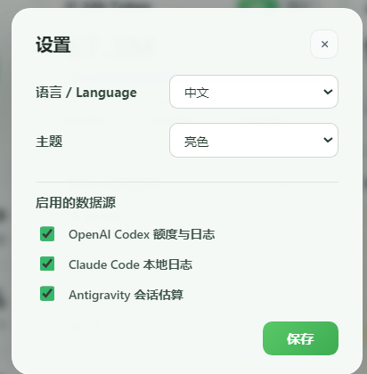
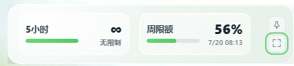

# AI 额度（AI Quota Widget）

一个常驻桌面的 Windows 悬浮窗，用于查看 Codex 额度，以及 Codex、Claude Code 和 Antigravity 的本地 Token 用量。

[English](README_EN.md) · [下载发行版](https://github.com/w1ndwill/ai-quota-widget/releases)

## 界面

### 额度与用量总览



集中显示 Codex 额度、重置卡、近 24 小时与累计 Token、趋势图、每日热力图和缓存命中率。

### 按来源筛选模型



按 Codex、Claude Code、Antigravity 汇总或筛选模型用量。

### 数据源与外观



可分别启用数据源，并切换中英文、亮色或暗色主题和全局快捷键。

### 紧凑模式



仅保留额度摘要，适合置顶常驻。

## 主要功能

- 通过本机 Codex `app-server` 读取当前账号额度和重置时间。
- 展示重置卡数量、状态和到期时间。
- 统计本机 Codex、Claude Code 会话日志中的 Token 用量。
- 根据本机 Antigravity 会话估算 Token 用量；该数据不是官方账单。
- 提供模型筛选、趋势图、每日热力图和可用数据源的缓存命中率。
- 支持托盘运行、窗口置顶、紧凑模式和单实例运行。
- 支持自定义显示面板、紧凑模式、刷新和置顶快捷键。

默认快捷键：

- `Ctrl+Shift+Space`：显示或隐藏主面板
- `Ctrl+Shift+M`：切换紧凑模式

## 使用说明

1. 从 [Releases](https://github.com/w1ndwill/ai-quota-widget/releases) 下载 Windows 安装包。
2. 如需查看 Codex 官方额度，请先安装并登录 Codex 桌面端。
3. 启动 AI 额度；程序会自动查找本机 `codex.exe`，无需手动填写路径。

Codex 未安装或未登录时，Claude Code 和 Antigravity 的本地用量统计仍可使用，Codex 额度区域会显示读取失败。未安装或未使用某个数据源时，对应统计为空是正常现象。

程序只读取当前用户的本地会话文件。配置和缓存保存在程序目录下的 `.userdata` 文件夹中。

## 本地开发

需要 Node.js 20 或更高版本。

```powershell
npm install
npm start
npm test
```

构建 Windows 绿色版：

```powershell
npm run build:win
```

构建 Windows 安装包：

```powershell
npm run release:win
```

构建结果位于 `release/`。版本变化见 [CHANGELOG.md](CHANGELOG.md)。

## 项目结构

```text
src/      应用源码
test/     自动化测试
docs/     文档图片
scripts/  构建脚本
```

## 许可证

[MIT](LICENSE)
