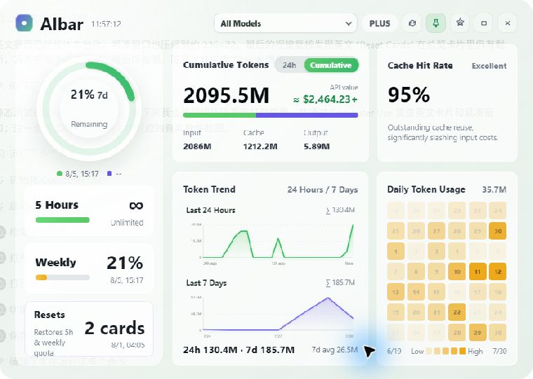
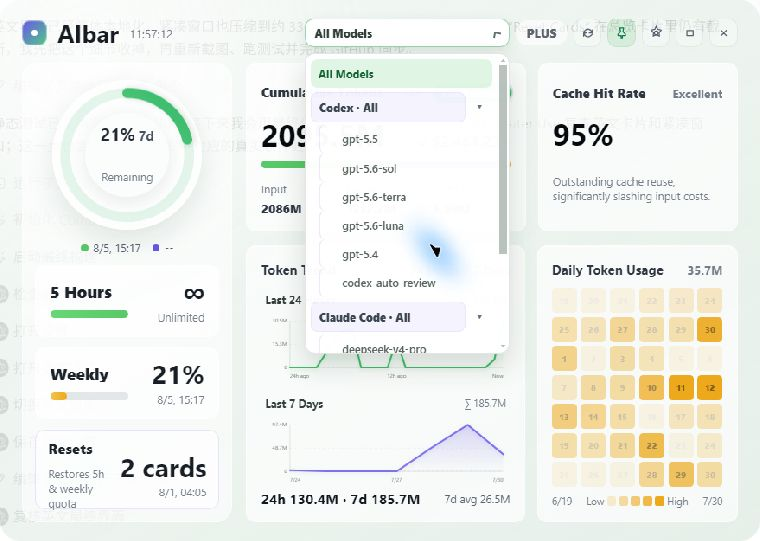
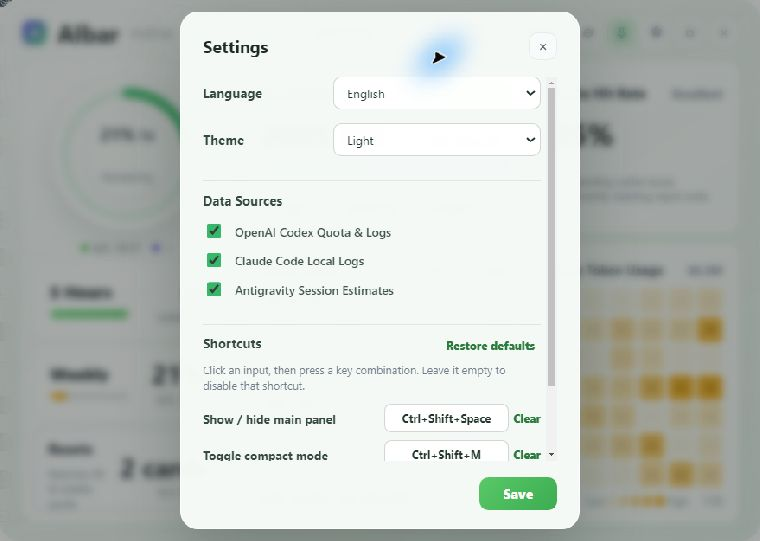
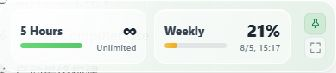

# AI Quota Widget

A Windows desktop widget for viewing Codex quota and local token usage from Codex, Claude Code, and Antigravity, with complete Chinese and English interfaces.

[中文](README.md) · [Download](https://github.com/w1ndwill/ai-quota-widget/releases)

## Screenshots

These screenshots come from the current application running with local data; quota, token, and model values vary by machine. Click an image to open it at full size.

### Quota and usage overview

[](docs/images/en/dashboard-overview.jpg)

View Codex quota, reset cards, 24-hour and cumulative token usage, trends, a daily heatmap, and cache-hit rates.

### Filter models by source

[](docs/images/en/model-source-filter.jpg)

Aggregate or filter model usage by Codex, Claude Code, and Antigravity.

### Data sources and appearance

[](docs/images/en/settings-data-sources.jpg)

Enable each data source independently and configure the language, theme, and global shortcuts. Language changes update the dashboard, charts, model picker, and accessibility labels together.

### Compact mode

[](docs/images/en/compact-mode.jpg)

Shrink the window to `336 × 72` logical pixels with only the two quota periods plus pin and expand controls.

## Features

- Reads the current account quota and reset time from the local Codex `app-server`.
- Shows reset-card counts, status, and expiry details.
- Calculates token usage from local Codex and Claude Code session logs.
- Estimates the USD value of tokens from each model's public standard text API rates (not a subscription bill).
- Estimates token usage from local Antigravity sessions; this is not official billing data.
- Provides model filters, trend charts, a daily heatmap, and cache-hit rates where available.
- Provides complete Chinese and English interfaces with light and dark themes.
- Supports tray operation, always-on-top, a `336 × 72` compact mode, and single-instance startup.
- Supports configurable shortcuts for panel visibility, compact mode, refresh, and always-on-top.

Default shortcuts:

- `Ctrl+Shift+Space`: show or hide the main panel
- `Ctrl+Shift+M`: toggle compact mode

## Getting started

1. Download the Windows installer from [Releases](https://github.com/w1ndwill/ai-quota-widget/releases).
2. To view official Codex quota, install and sign in to the Codex desktop app first.
3. Start AI Quota Widget. It finds the local `codex.exe` automatically.

If Codex is unavailable, local Claude Code and Antigravity usage statistics still work while the Codex quota area reports a read failure. An unused or unavailable data source simply has no usage data.

The application reads session files for the current user only. Settings and caches are stored in the `.userdata` folder beside the application.

The UI's HTML, CSS, and JavaScript load once when the window starts. While running, only quota and local-log data are refreshed as needed. Hiding the app to the tray pauses UI refreshes and releases the log worker and app-managed Codex subprocess after an idle period.

## Development

Node.js 20 or newer is required.

```powershell
npm install
npm start
npm test
```

Build the unpacked Windows application:

```powershell
npm run build:win
```

Build the Windows installer:

```powershell
npm run release:win
```

Build artifacts are written to `release/`. See [CHANGELOG.md](CHANGELOG.md) for version history.
When rebuilding the unpacked app, the build script preserves settings and caches in `release/win-unpacked/.userdata`.

## Project structure

```text
src/      Application source
test/     Automated tests
docs/     Documentation images
scripts/  Build scripts
```

## License

[MIT](LICENSE)
